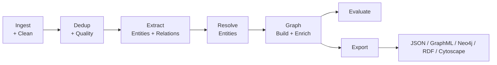

# Knowledge Graph Generator

[](https://www.python.org/)
[](LICENSE)
[](https://github.com/vietnam-ai-challenge/kg-generator/actions/workflows/ci.yml)

A modular pipeline for converting raw text into structured knowledge graphs — built for LLM training, dataset curation, and Graph RAG workflows. Supports English and Vietnamese with a pluggable extraction backend (spaCy, `underthesea`, or LLM-powered GraphGen).

## Architecture



## Quick Start

```bash
# Using uv (recommended)
uv venv && source .venv/bin/activate
uv pip install -e "."
python -m spacy download en_core_web_sm

# Run with defaults on sample data
kg-gen quick -i data/debugg_sample/ -o output/demo
```

## Installation

| Method | Command |
|---|---|
| **pip (basic)** | `pip install -e "."` |
| **uv (recommended)** | `uv pip install -e "."` |
| **+ embeddings** | `uv pip install -e ".[embeddings]"` |
| **+ Vietnamese** | `uv pip install -e ".[vi]"` |
| **+ Neo4j** | `uv pip install -e ".[neo4j]"` |
| **+ LLM extraction** | `uv pip install -e ".[llm]"` |
| **+ everything** | `uv pip install -e ".[all]"` |
| **Docker** | `docker build -t kg-gen .` |

## CLI

```bash
kg-gen run -c configs/pipeline.yaml -i data/input/ -o output/
kg-gen curate -i data/raw/ -m configs/example_source_manifest.yaml -o output/curated/
kg-gen neo4j-upload -o output/ --clear
kg-gen evaluate --kg data/samples/sample_kg.json
```

See [docs/usage.md](docs/usage.md) for the full command reference.

## Core Features

- **Modular pipeline** — ingest → dedup → extract → resolve → graph → evaluate → export
- **Multi-format input** — JSONL, CSV, TXT, JSON
- **Layered deduplication** — MinHash, SimHash, n-gram, semantic (document-level + chunk-level)
- **Quality filtering** — heuristic scoring for noisy web text
- **Entity extraction** — spaCy (English), `underthesea` (Vietnamese), or LLM-powered GraphGen
- **Entity resolution** — string-similarity and embedding-based
- **Graph backends** — NetworkX (in-memory) or Neo4j (on-disk, production-ready)
- **Multi-format export** — JSON, GraphML, Neo4j CSV, RDF/Turtle, Cytoscape.js
- **Evaluation suite** — structural audit, SFT data quality scoring, fact coverage, model ablation benchmarking
- **Dataset curation** — provenance tracking, audit reports, token-budget training shards
- **Vietnamese pipeline** — tokenization, NER, chunking, and GraphGen prompts for Vietnamese text
- **Web demo** — FastAPI backend + interactive frontend (`demo/`)

## Evaluation

The evaluation suite provides two complementary assessments:

| Method | What it measures | Runtime |
|---|---|---|
| **Method 1 — Data Quality** | Graph health (orphans, density, schema, duplicates), SFT pair quality (faithfulness, relevancy), fact coverage | Seconds (CPU) |
| **Method 2 — Model Ablation** | Does KG-structured training data produce a better model? Fine-tunes base → KG-managed → raw-text and benchmarks all three | Hours (GPU recommended) |

```bash
# Quick data quality check
python -m kg_generator.evaluate.run_eval --method 1 --kg data/samples/sample_kg.json

# Full ablation study
python -m kg_generator.evaluate.run_eval --method all --kg data/samples/sample_kg.json
```

See [docs/evaluation.md](docs/evaluation.md) for details.

## Project Structure

```
src/kg_generator/           Main package
├── ingest/                 Data loading, cleaning, chunking
├── dedup/                  Document & chunk deduplication, quality filtering
├── curate/                 Dataset curation with provenance tracking
├── extract/                Entity & relation extraction (spaCy, underthesea, GraphGen/LLM)
├── resolve/                Entity resolution & deduplication
├── graph/                  Graph construction (NetworkX, Neo4j)
├── evaluate/               Evaluation suite
│   ├── data_eval/          Structural audit, SFT quality, fact coverage
│   ├── model_eval/         QA dataset generation, LoRA fine-tuning, ablation benchmarking
│   ├── graphgen/           Paper-inspired subgraph + multi-hop QA
│   └── plots/              Visualization utilities
├── export/                 JSON, GraphML, Neo4j CSV, RDF, Cytoscape.js
├── cli.py                  Command-line interface (kg-gen)
├── pipeline.py             Pipeline orchestrator
└── api.py                  FastAPI demo backend

configs/                    YAML pipeline presets
docs/                       Documentation
data/                       Sample inputs & curated outputs
tests/                      pytest test suite (71 tests)
demo/                       Interactive web demo
presentation/               Project presentation deck
```

## Contributing

See [CONTRIBUTING.md](CONTRIBUTING.md) for setup instructions, code style, and PR guidelines.

## License

MIT — see [LICENSE](LICENSE) for details.

