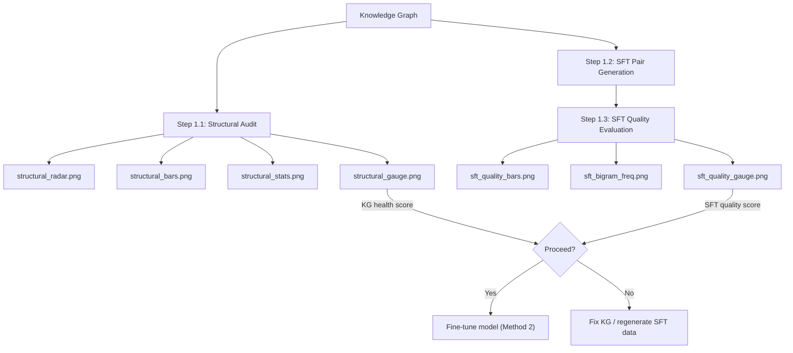

# Understanding Method 1 Plots

Method 1 (SFT Data Quality Assessment) evaluates the quality of a knowledge graph (KG) and the SFT (Supervised Fine-Tuning) data generated from it. It produces **7 plots** across two evaluation stages: **structural audit** and **SFT quality evaluation**.

All plots are saved in `output_eval/latest/method1/`.

---

## 1. Structural Audit Plots (Step 1.1)

These plots assess the **health of the knowledge graph itself** — before any SFT data is generated. A structurally sound KG is critical for producing high-quality training data.

---

### 1.1 `structural_radar.png` — Structural Health Radar

**What it shows:** A spider/radar chart with 5 dimensions of KG health:

| Dimension | What it measures |
|-----------|-----------------|
| **Orphans** | Nodes with no edges — isolated entities that contribute nothing to the graph |
| **Density** | Edge-to-node ratio — how interconnected the graph is |
| **Schema** | Compliance with the defined ontology (valid relations, entity types) |
| **Duplication** | Near-duplicate entities that should be merged |
| **Multi-hop** | How many node pairs are reachable within 2 or 3 hops |

**How to read:**
- Each axis ranges from 0 (center) to 100 (outer edge).
- **Larger filled area = healthier KG.** A nearly full pentagon means the KG is in great shape.
- **Point colors:** Green = healthy, Yellow = moderate concern, Red = needs attention.
- The title shows the overall health score out of 100.

**Example interpretation:** If the "Multi-hop" dimension is low (e.g., 77), it means many entities are too far apart to support multi-hop reasoning chains — this limits the complexity of QA pairs you can generate.

---

### 1.2 `structural_bars.png` — Category Breakdown

**What it shows:** Two side-by-side horizontal bar charts breaking down each health dimension:

- **Left panel (Metric Values):** The raw metric value for each category:
  - *Orphan Rate* — fraction of nodes that are isolated (0 = perfect, no orphans)
  - *Density* — graph density (ideal range: 0.005–0.2)
  - *Schema Compliance* — fraction of edges that conform to the ontology (1.0 = perfect)
  - *Entity Duplication* — number of duplicate entity pairs found (0 = perfect)
  - *Multi-hop (2-hop %)* — percentage of node pairs reachable within 2 hops
  - *Multi-hop (3-hop %)* — percentage of node pairs reachable within 3 hops

- **Right panel (Health Scores):** A 0–100 health score derived from each metric.

**How to read:**
- **Bar colors** follow the traffic-light system: 🟢 green (good), 🟡 yellow (fair), 🔴 red (poor).
- **Dashed vertical lines** in the health score panel mark thresholds: green line at 80 (healthy), orange at 60 (borderline), red at 40 (unhealthy).
- Look for red or yellow bars — those are the dimensions you should address first.

---

### 1.3 `structural_stats.png` — Graph Statistics Summary

**What it shows:** Two panels summarizing raw graph metrics:

- **Left panel (Graph Size):** A simple bar chart showing:
  - **Nodes** — total entities + chunks in the KG
  - **Edges** — total relationships/connections
  - **Triples** — total (subject, predicate, object) triples

- **Right panel (Density Gauge):** A horizontal bar showing graph density with the ideal range annotation (0.005–0.2).

**How to read:**
- High edge-to-node ratio means the graph is densely connected (good for reasoning, but too high may indicate noise).
- **Density below 0.005** → graph is too sparse; entities are barely connected.
- **Density above 0.2** → graph may be over-connected (possible false edges or overly generic relations).
- The bar color indicates whether density is in the healthy range.

---

### 1.4 `structural_gauge.png` — Overall Health Gauge

**What it shows:** A semi-circular speedometer-style gauge displaying the **overall KG health score** (0–100).

**How to read:**
- The needle points to the score. The colored background zones indicate:
  - 🔴 Red zone (0–40): **Unhealthy** — significant structural problems
  - 🟠 Orange zone (40–60): **Needs improvement** — multiple concerns
  - 🟡 Yellow zone (60–80): **Fair** — minor issues
  - 🟢 Green zone (80–100): **Healthy** — KG is structurally sound

- The verdict text below the gauge provides a qualitative summary.

**Example interpretation:** A score of 95.3 with the verdict "Healthy — KG is structurally sound for SFT data generation" means you can proceed confidently to SFT generation.

---

## 2. SFT Quality Plots (Step 1.3)

These plots assess the **quality of the SFT (instruction-response) pairs** generated from the KG. They tell you whether the training data is faithful to the source, diverse enough, and factually correct.

---

### 2.1 `sft_quality_bars.png` — Quality Metrics Bar Chart

**What it shows:** A bar chart of 4 key quality metrics on a 0–1 scale:

| Metric | What it measures | Ideal value |
|--------|-----------------|-------------|
| **Faithfulness** | Do responses stay true to the source KG triples, or do they hallucinate entities? | > 0.7 |
| **Answer Relevancy** | Does the response actually answer the instruction? (keyword overlap proxy) | > 0.7 |
| **Factual Correctness** | Are entities mentioned in the response present in the source triples? | > 0.7 |
| **Diversity** | How varied is the language? (unique bigram ratio) | > 0.5 |

**How to read:**
- **Dashed lines** mark quality thresholds: green line at 0.7 ("Good"), orange line at 0.4 ("Fair").
- Bar colors match the metric (red = faithfulness, blue = relevancy, green = factual, purple = diversity).
- The exact score is displayed on top of each bar.
- Below each bar, a brief diagnostic message explains the score (e.g., "30/35 responses contain entities not in source triples").
- The title shows how many SFT pairs were evaluated.

**Example interpretation:** Faithfulness = 0.143 with the note "30/35 responses contain entities not in source triples" is a 🚨 **major red flag** — the generated responses are hallucinating entities that don't exist in the KG. You would need to tighten the generation prompts or use a stricter decoding strategy.

---

### 2.2 `sft_bigram_freq.png` — Bigram Frequency Chart

**What it shows:** A horizontal bar chart of the **top 15 most common word pairs (bigrams)** found across all generated SFT responses.

**How to read:**
- Longer bars = more frequently occurring phrase patterns.
- The title includes the overall diversity score.
- **Red flag indicators:**
  - A few bigrams dominating (e.g., "associated with" appearing 17 times) → responses are **formulaic and templated**.
  - High repetition of phrases like "the first," "first female," "female professor" → the generator is stuck on a narrow set of topics or patterns.
- **Healthy pattern:** The bars should show relatively even distribution — no single bigram vastly outnumbers the others.
- The color gradient (from bright to dark) helps visualize the falloff — ideally it should be a gentle slope, not a cliff.

**Example interpretation:** If the diversity score is 0.397 (red flag) and the detail says "only 40% unique bigrams," your SFT data lacks linguistic variety. The model fine-tuned on this data would likely produce repetitive outputs.

---

### 2.3 `sft_quality_gauge.png` — Overall SFT Quality Gauge

**What it shows:** A donut-style gauge displaying the **overall SFT quality score** (0–1 scale).

**How to read:**
- The filled arc represents the score. The color indicates quality level:
  - 🔴 Red (0–0.4): **Poor** — significant quality issues
  - 🟠 Orange (0.4–0.6): **Fair** — usable but needs improvement
  - 🟡 Yellow (0.6–0.8): **Good** — solid quality
  - 🟢 Green (0.8–1.0): **Excellent** — ready for fine-tuning

- The center shows the number of evaluated pairs.
- The title/verdict provides the qualitative assessment.

**Example interpretation:** A score of 0.506 ("Fair — consider improving the KG before generating SFT data") suggests the data is borderline usable. You should investigate which specific metric (faithfulness, relevancy, factual, or diversity) is dragging the score down and address it.

---

## 3. How the Plots Fit Together

- **Start with the structural plots** — if the KG itself is unhealthy, no amount of prompt engineering will produce good SFT data.
- **Then check the SFT quality plots** — they reveal whether the generated instruction-response pairs are faithful, diverse, and factually grounded.
- **Use the gauges (`structural_gauge.png`, `sft_quality_gauge.png`) as quick health checks**, then drill into the bar charts and radar for diagnostics.

---

## 4. Key Thresholds Reference

| Plot | Metric | 🟢 Good | 🟡 Fair | 🔴 Poor |
|------|--------|---------|---------|---------|
| Structural Gauge | Overall KG Health | ≥ 80 | 60–79 | < 60 |
| Structural Radar | Orphans | 100 (no orphans) | < 100 | < 70 |
| Structural Radar | Schema Compliance | 100% | 90–99% | < 90% |
| Structural Stats | Density | 0.005–0.2 | — | < 0.005 or > 0.2 |
| SFT Quality Bars | Faithfulness | ≥ 0.7 | 0.4–0.69 | < 0.4 |
| SFT Quality Bars | Answer Relevancy | ≥ 0.7 | 0.4–0.69 | < 0.4 |
| SFT Quality Bars | Factual Correctness | ≥ 0.7 | 0.4–0.69 | < 0.4 |
| SFT Quality Bars | Diversity | ≥ 0.5 | 0.3–0.49 | < 0.3 |
| SFT Quality Gauge | Overall SFT Score | ≥ 0.8 | 0.6–0.79 | < 0.6 |

---

## 5. Common Issues & What to Do

| Observation | Likely cause | Recommended action |
|-------------|-------------|-------------------|
| Low faithfulness + high factual correctness | Responses include correct entities but also hallucinate new ones | Tighten SFT generation prompt; add "only use entities from the provided triples" constraint |
| High factual correctness but low diversity | Responses are factually grounded but use repetitive language | Vary the instruction templates; increase generation temperature |
| Low multi-hop connectivity | KG is fragmented — entities don't chain well | Add bridging relations; merge duplicate entities; enrich the KG with more connections |
| Many orphans | Entities were extracted but never linked | Review entity resolution step; ensure all extracted entities get at least one relationship |
| High entity duplication | Same real-world entity appears under multiple names | Run entity resolution/deduplication with a lower similarity threshold |
| Schema violations | Edges use relations not defined in the ontology | Review the extraction prompt to enforce ontology compliance; filter non-conforming edges |

---

> **Note:** When the evaluation uses heuristic scoring (rather than LLM-as-Judge via `deepeval`), the metrics are approximate proxies. For production use, install `deepeval` and re-run with LLM-based scoring for more reliable quality estimates.
